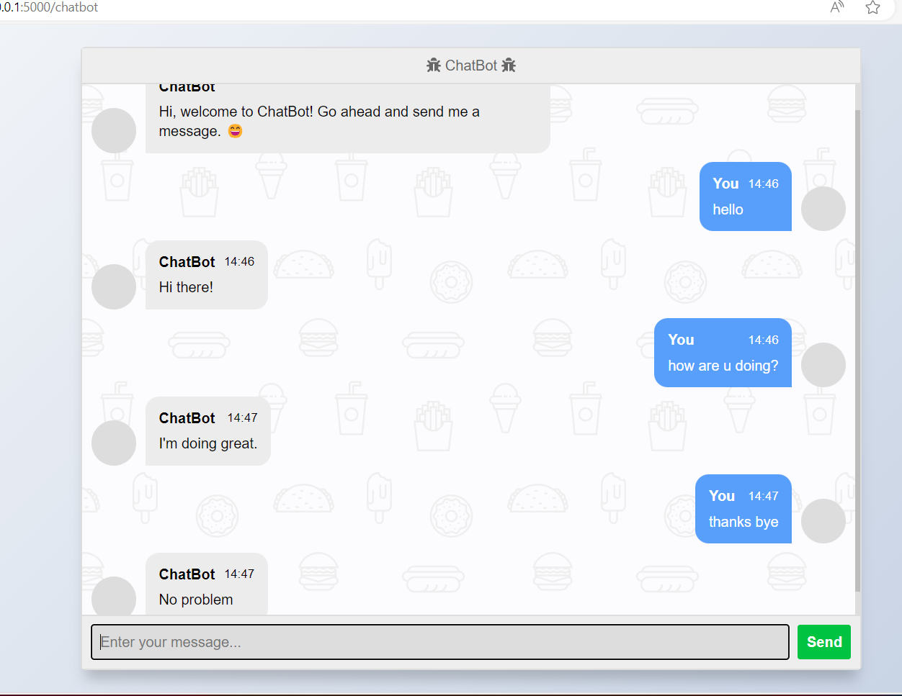
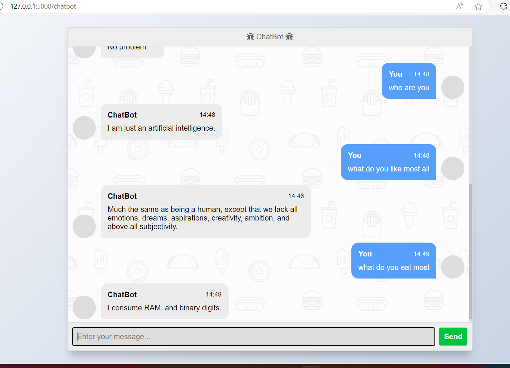

# ChatBot

A simple chatbot application developed using Flask and the ChatterBot library, capable of conducting basic conversations. This chatbot leverages Natural Language Processing (NLP) techniques to understand and respond to user input. It's designed to showcase the basic functionalities of a chatbot and serves as a foundation for more complex chatbot applications.

## Features

- Basic conversation abilities with predefined responses.
- Training on a custom dataset as well as the ChatterBot English corpus.
- A web interface for interacting with the chatbot.

## Installation

Before starting, ensure you have Python installed on your machine. Then, clone the project to your local machine:

```bash
git clone <repository-url>
```

Navigate into the project directory:

```bash
cd <project-directory>
```

Install the required dependencies:

```bash
pip install -r requirements.txt
```

## Usage

To start the chatbot application, run:

```bash
python app.py
```

This command starts a local web server. Open your web browser and go to the following URL to interact with the chatbot:

```
127.0.0.1:5000/chatbot
```

## Project Structure

- `app.py`: The main Flask application file.
- `chatbot.py`: Contains the chatbot logic, including training data and response mechanisms.
- `templates/index.html`: The HTML template for the chatbot interface.
- `static/styles/style.css`: (If exists) Contains custom CSS styles for the chatbot interface.

## Screenshots

Below are screenshots of the chatbot in action. These images are stored in the same folder as the project.





## Future Enhancements

This chatbot serves as a basic demonstration. Future enhancements can include:
- Integration with more advanced NLP models for improved understanding and response generation.
- Implementation of additional features such as voice input and response.
- Training the chatbot with a larger and more diverse dataset for better conversation quality.


## Acknowledgements

- ChatterBot library: [ChatterBot GitHub](https://github.com/gunthercox/ChatterBot)
- Flask: [Flask Website](https://flask.palletsprojects.com/)

```
